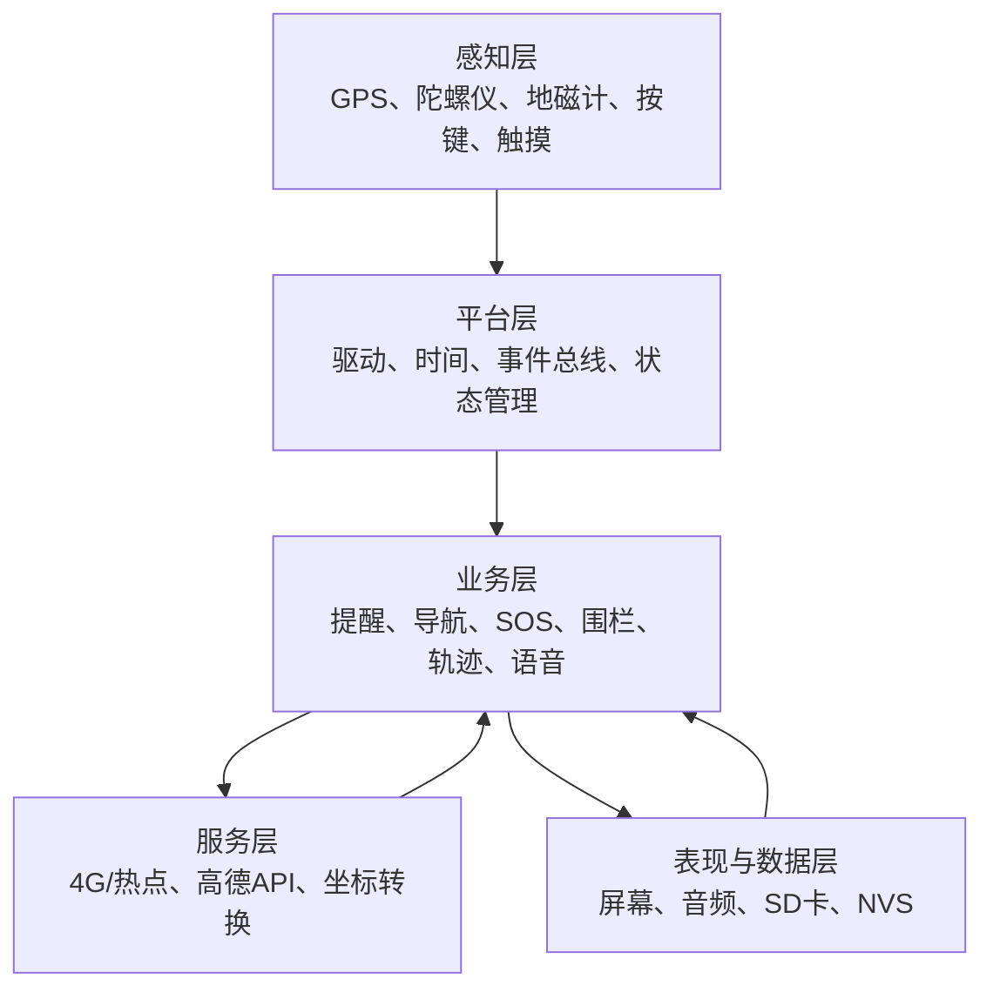
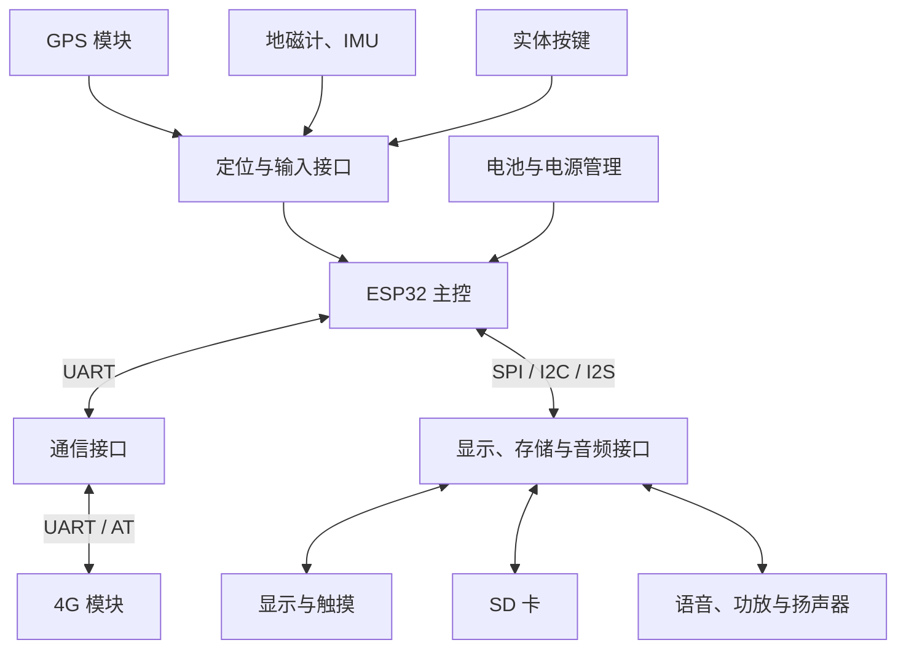
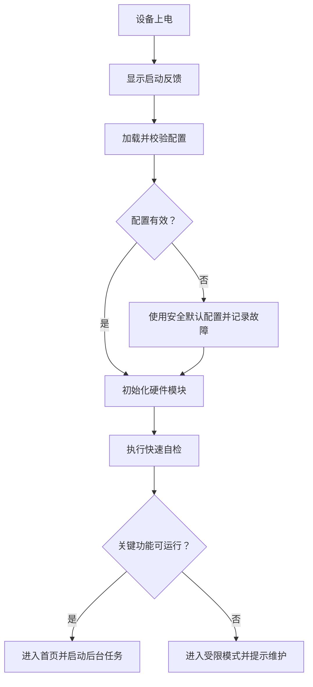
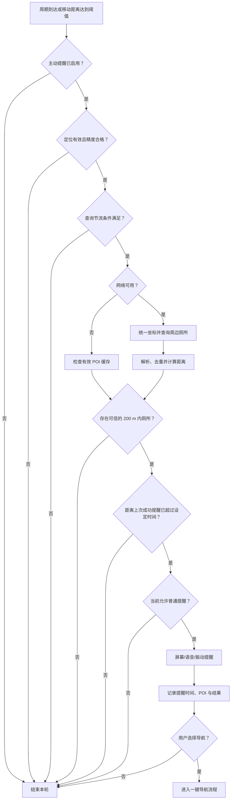
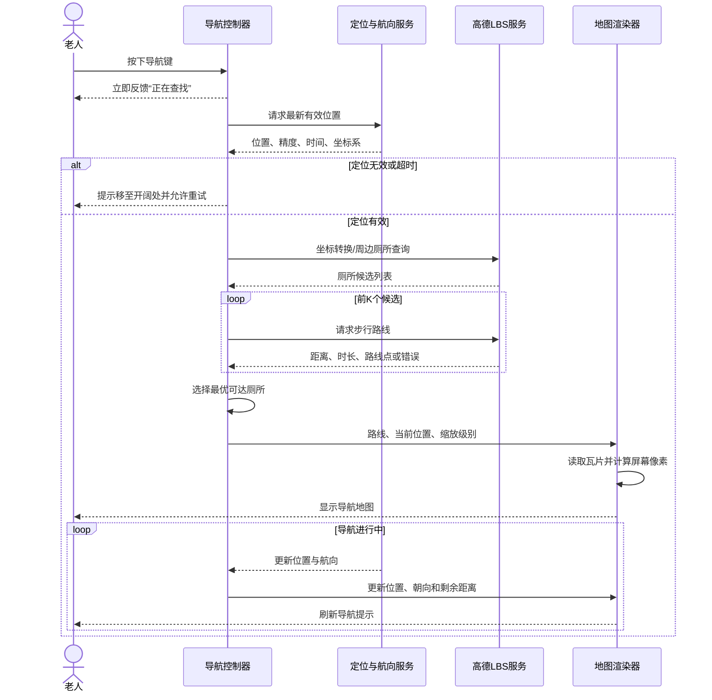
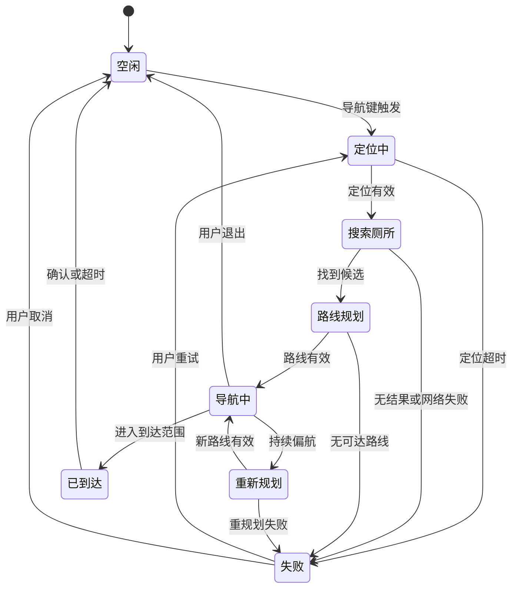
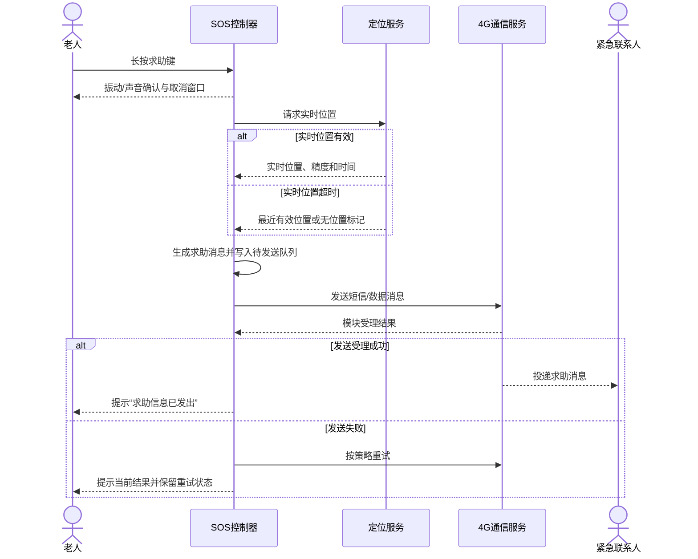
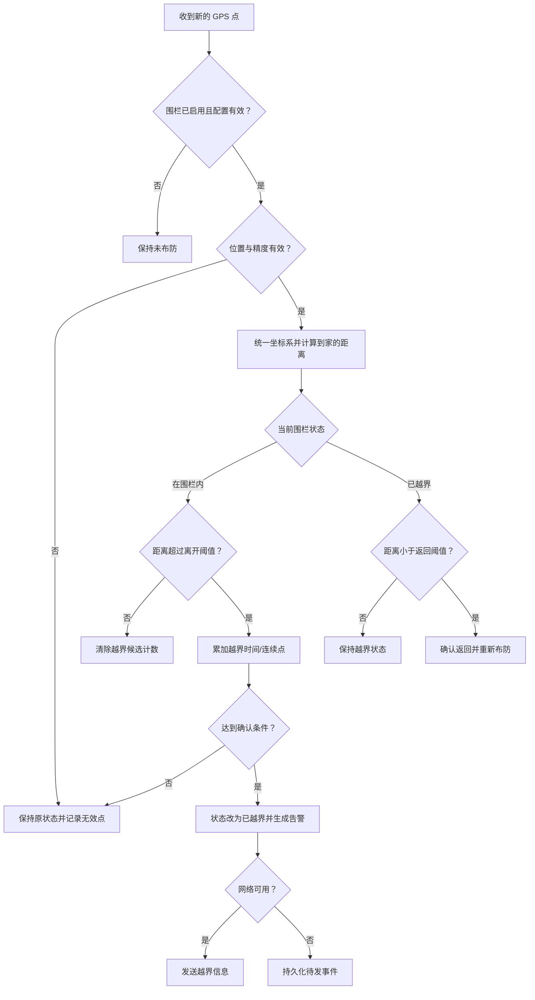
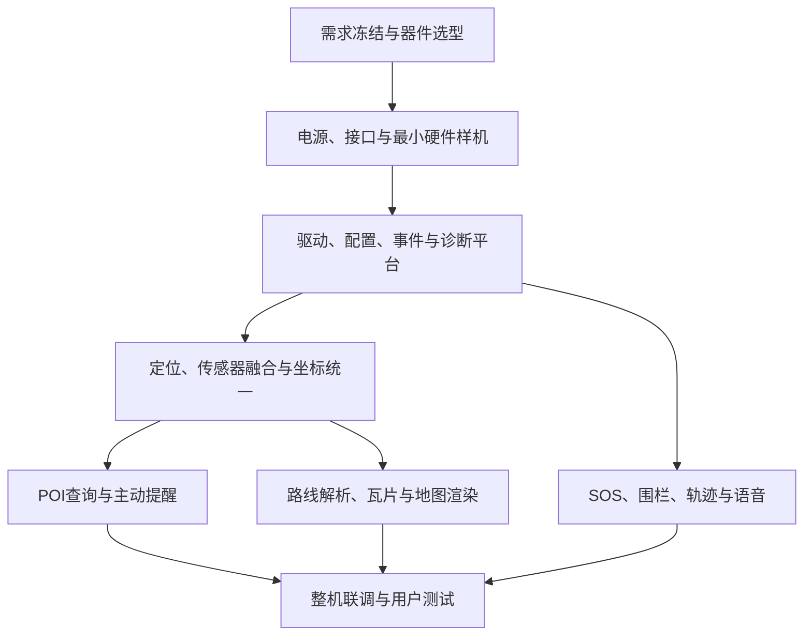

# 老人外出寻厕辅助设备——需求分析与系统拆解

> - 文档类型：产品需求说明书（PRD）+ 软件需求规格说明书（SRS）初稿
> - 目标平台：ESP32 Dev Module
> - 文档版本：V1.0
> - 编写日期：2026-07-31
> - 状态：需求评审稿

---

## 1. 文档目的

本文档将“帮助外出尿频老人寻找附近厕所，并在异常情况下获得帮助”的产品想法拆解为可设计、可开发、可测试、可验收的系统需求，主要用于：

- 明确产品目标、用户、使用场景和系统边界；
- 将 6 项核心功能拆分成设备端、网络端、地图端、存储端和交互端需求；
- 给出关键业务流程、状态机、时序和异常降级策略；
- 明确 ESP32、4G、GPS、屏幕、惯性传感器、语音和 SD 卡之间的接口关系；
- 为后续原理图、PCB、嵌入式软件、UI、联调和测试提供输入；
- 暴露当前方案中的缺失模块、技术风险和待确认项。

本文档不等同于详细设计。GPIO 分配、电源参数、具体通信指令、API 请求字段和任务栈大小，需要在选定各模块具体型号后形成《硬件详细设计》和《软件详细设计》。

---

## 2. 产品概述

### 2.1 产品定位

本产品是一款面向外出老人，尤其是尿频、不会熟练使用智能手机或不会讲普通话人群的便携式辅助设备。设备通过大按键、简化界面、语音和地图，为老人提供：

1. 附近厕所主动提醒；
2. 一键查找并导航至附近厕所；
3. 一键向紧急联系人求助；
4. 离家超范围告警；
5. 本地轨迹记录；
6. 一键播放预存求助语音。

### 2.2 核心价值

- 降低老人因找不到厕所而产生的焦虑和出行顾虑；
- 将“打开手机—解锁—打开地图—搜索—选择路线”的复杂操作压缩为一次按键；
- 在迷路、身体不适、无法有效沟通等情况下建立求助通道；
- 让家属在老人离开安全范围时及时获知情况。

### 2.3 产品成功标准

产品达到可用状态至少应满足：

- 老人不需要输入文字即可完成寻厕、求助和语音播放；
- 定位和网络有效时，可自动发现 200 m 内厕所，并按设定的提醒间隔抑制重复提醒；
- 导航按键按下后，能明确反馈“正在定位、正在查询、开始导航或失败原因”；
- 求助动作触发后，即使地图服务不可用，也能独立尝试发送求助消息；
- 电子围栏在定位漂移条件下不会因单个异常点频繁误报；
- SD 卡异常、网络断开、GPS 无效、API 失败等情况不会造成设备死机；
- 所有关键功能均具有可执行的验收测试。

---

## 3. 用户、角色与典型场景

### 3.1 角色定义

| 角色 | 主要诉求 | 典型操作 |
|---|---|---|
| 老人用户 | 操作简单、提示清晰、快速找到厕所、遇险能求助 | 按导航键、按求助键、按语音键、查看/听取提示 |
| 紧急联系人 | 及时收到求助或越界消息，知道老人位置和时间 | 接收短信/消息、打开位置链接、回拨电话 |
| 家属/管理员 | 配置联系人、家庭位置、围栏半径、提醒时间等 | 在设备设置页、本地配置工具或配套端进行设置 |
| 维护人员 | 安装地图、语音文件，排查模块和日志问题 | 维护 SD 卡、查看诊断信息、升级固件 |
| 地图/LBS 服务 | 提供厕所 POI、坐标转换和步行路径规划 | 接收 HTTPS 请求并返回 JSON 数据 |

### 3.2 典型使用场景

#### 场景 A：路过厕所时主动提醒

老人正常步行，设备周期性获得有效位置。设备发现 200 m 内存在厕所，且自上一次“成功提醒”起已经超过 30 min，于是通过屏幕、语音或振动提醒“附近有厕所”。老人可以忽略，也可以按导航键开始导航。

#### 场景 B：老人主动寻找厕所

老人按下导航键。设备获取当前位置、联网搜索附近厕所、比较候选厕所、规划步行路线，从 SD 卡加载对应地图瓦片，绘制路线、当前位置和行进方向，并在移动过程中更新显示。

#### 场景 C：无法联网但需要找厕所

设备无法访问高德服务。若本地保存了有效期内的厕所候选和路线缓存，则进入缓存导航；否则提示“网络不可用，无法获取新路线”，仍保留求助和求助语音功能。仅有离线地图瓦片不等于具备完整离线路径规划能力。

#### 场景 D：老人遇到紧急情况

老人长按求助键。设备立即反馈已识别操作，获取最近有效位置，通过 4G 模块发送包含时间、位置、电量和原因标识的求助消息。发送失败时进行有限次数重试并明确提示结果。

#### 场景 E：老人走出家庭安全范围

设备持续计算当前位置到家庭中心点的距离。当距离超过围栏外边界，且连续多个有效定位点或持续一段时间均在围栏外，设备向紧急联系人发送越界消息。回到围栏内边界后重新布防。

#### 场景 F：语言沟通困难

老人按下语音键，设备立即播放 SD 卡中预先选择的求助语音，例如“您好，我迷路了，请帮我联系家人”。播放期间仍允许高优先级的 SOS 事件抢占。

---

## 4. 范围定义

### 4.1 本期范围

- GPS 定位、定位有效性判断和基础位置滤波；
- GPS、陀螺仪、地磁计的方向融合；
- 高德周边厕所查询、坐标转换和步行路径规划；
- SD 卡离线地图瓦片管理与地图渲染；
- 主动厕所提醒和提醒间隔控制；
- 一键导航及位置、方向、路线实时显示；
- 一键 SOS 消息发送；
- 本地电子围栏判断和越界通知；
- 轨迹记录、文件轮换和存储异常处理；
- 求助语音文件选择、播放、停止和音量控制；
- 基础设置、状态显示、故障提示和日志。

### 4.2 建议暂不纳入首版

- 设备端完整的离线 POI 数据库和离线路径规划引擎；
- 复杂语音识别、连续语音对话；
- 室内高精度定位；
- 医疗诊断或生命体征监护；
- 由设备自动判断老人是否摔倒并直接报警；
- 地图瓦片自动全量下载和复杂区域管理；
- 多用户、多设备云平台的完整运营后台。

### 4.3 明确的能力边界

1. **离线地图只解决“显示底图”问题。** 厕所 POI 搜索和新路线计算仍依赖网络，除非另行开发本地 POI 库与离线路由引擎。
2. **GPS 在室内、地下、建筑密集区可能长时间无效。** 设备应说明无法定位，不能伪造精确位置。
3. **陀螺仪会漂移，地磁计会受金属和 4G 电流干扰。** 方向只能通过校准、融合和质量判断提高稳定性，不能保证所有环境下准确。
4. **电子围栏是辅助告警，不是人身安全保证。** 定位误差、网络中断和设备断电都可能导致延迟或漏报。
5. **“最近厕所”存在两种定义。** 直线最近不一定步行最近；本方案建议先按直线距离筛选候选，再以步行路线距离或预计时间确定最终目的地。

---

## 5. 需求假设与统一定义

### 5.1 初始默认值

以下值用于原型开发，量产前需通过用户测试确认：

| 参数 | 建议默认值 | 是否可配置 | 说明 |
|---|---:|---|---|
| 厕所提醒半径 `R_toilet` | 200 m | 是 | 判断附近是否存在厕所 |
| 重复提醒间隔 `T_remind` | 30 min | 是 | 从上一次成功提醒时刻开始计算 |
| 主动搜索周期 | 2 min 或移动 100 m | 是/内部参数 | 降低流量与功耗；导航时不使用此周期 |
| 导航定位更新周期 | 1 s | 内部参数 | 受 GPS 输出频率限制 |
| 非导航轨迹采样周期 | 5～10 s | 是 | 可结合移动距离触发 |
| SOS 长按时间 | 2 s | 是 | 防止误触，可保留取消窗口 |
| 围栏半径 | 由家属设置 | 是 | 必须设置后才启用 |
| 越界确认时间 | 30～60 s | 是 | 或连续 3～5 个有效定位点 |
| 围栏回差 `H` | 20～50 m | 是/内部参数 | 防止边界附近反复进出 |
| 定位最大可接受误差 | 提醒/围栏 50 m，导航 30 m | 是/内部参数 | 具体取值由 GPS 实测确定 |

### 5.2 关键定义

- **有效定位**：至少包含有效经纬度、有效时间戳、定位状态，且估计水平误差低于当前功能阈值；不能只判断是否收到 NMEA 字符串。
- **成功提醒**：屏幕、声音或振动中的至少一个主要提醒通道已经执行，并写入提醒时间记录。
- **最近有效位置**：在设定有效期内保存的最后一个合格 GPS 点；SOS 可使用较宽松阈值，但必须标注“实时位置”或“最近位置”。
- **一次越界事件**：从“已在围栏内”进入“确认在围栏外”，直到再次确认回到围栏内为止。同一事件默认只发送一次首报，是否周期复报需配置。
- **导航会话**：从用户触发导航，到到达、用户退出或错误终止之间的完整状态周期。
- **路线缓存**：包含起点区域、目的地、路线点、生成时间、坐标系和地图版本的信息；超时或偏航后不可盲目继续使用。

### 5.3 坐标系要求

GPS 模块通常输出 WGS‑84 坐标，而高德服务使用高德坐标。所有参与 POI 查询、路径规划、离线瓦片选取、路线绘制和电子围栏计算的数据，都必须带有明确的坐标系标识。

建议采用以下规则：

- 原始 GPS 点保留为 WGS‑84，用于原始轨迹和诊断；
- 调用高德相关服务及绘制高德底图前，将 GPS 点统一转换为高德坐标；
- 高德返回的 POI 和路线点按高德坐标处理，禁止重复转换；
- 家庭围栏中心点必须记录其坐标系；本地距离计算前将两点统一到同一坐标系；
- 若使用高德坐标转换 Web API，需考虑其网络依赖和调用量；工程上可评估合规的本地转换方案，但需确认授权与精度。

高德官方坐标转换接口明确用于将 GPS 等非高德坐标转换为高德坐标；当前接口支持批量坐标输入，但具体调用量、授权和参数仍应在发布前按官方文档复核。

---

## 6. 系统总体架构

### 6.1 逻辑架构



### 6.2 硬件数据链路



### 6.3 软件分层

| 层级 | 主要组件 | 职责 |
|---|---|---|
| 硬件抽象层 | UART、SPI、I2C、GPIO、SD、显示、音频驱动 | 屏蔽具体模块差异，统一错误码和超时机制 |
| 基础服务层 | 时间服务、配置服务、日志服务、存储服务、网络管理 | 向业务层提供稳定接口 |
| 感知与融合层 | GPS 解析、定位质量判断、航向融合、运动状态识别 | 输出带质量标记的位置和方向 |
| LBS 层 | HTTPS 客户端、坐标转换、POI 搜索、步行路线解析 | 管理高德 API、超时、重试和配额 |
| 地图导航层 | 瓦片索引、缓存、投影、路线渲染、偏航和到达判断 | 将地理数据变为屏幕像素和导航状态 |
| 业务层 | 主动提醒、SOS、电子围栏、轨迹、语音 | 实现用户可感知功能 |
| UI 层 | 首页、地图页、联系人页、设置页、弹窗 | 提供大字体、强反馈、低认知负担的交互 |

---

## 7. 功能需求详细拆解

### 7.1 FR-00 启动、自检与运行状态

#### 7.1.1 功能要求

| 编号 | 需求 | 优先级 | 验收要点 |
|---|---|---:|---|
| FR-00-01 | 上电后加载 NVS 配置并检查配置版本、CRC 和必填项 | P0 | 配置损坏时恢复默认值并提示，不崩溃 |
| FR-00-02 | 初始化显示、按键、GPS、4G、SD、传感器和音频模块 | P0 | 单个非关键模块失败时进入降级模式 |
| FR-00-03 | 屏幕应尽快显示启动状态，避免老人误以为设备无响应 | P0 | 上电后 1 s 内出现视觉反馈，目标值待实测 |
| FR-00-04 | 自检结果应包含 GPS、网络、SD、音频、传感器、电量状态 | P1 | 设置页可查看诊断结果 |
| FR-00-05 | 设备应保存关键重启原因和最近错误码 | P1 | 看门狗复位、掉电重启可追溯 |
| FR-00-06 | 系统发生任务卡死时由看门狗恢复，恢复后保留故障记录 | P0 | 注入任务卡死可自动复位 |

#### 7.1.2 启动流程



### 7.2 FR-01 附近厕所主动提醒

#### 7.2.1 触发规则

在以下条件同时成立时触发提醒：

1. 主动提醒功能已启用；
2. 当前时间不在静音时段，或静音时段允许振动/屏幕提醒；
3. 当前定位有效；
4. 设备已获得有效的厕所 POI 结果；
5. 至少一个厕所与当前位置的直线距离不大于 `R_toilet`；
6. `当前时间 - 上次成功提醒时间 >= T_remind`；
7. 当前不处于 SOS、通话或其他需要抑制普通提醒的高优先级状态。

#### 7.2.2 功能要求

| 编号 | 需求 | 优先级 | 说明/验收 |
|---|---|---:|---|
| FR-01-01 | 支持启用/关闭主动提醒 | P0 | 关闭后不得后台弹出厕所提醒 |
| FR-01-02 | 提醒半径和冷却时间可设置 | P0 | 修改后无需重刷固件即可生效 |
| FR-01-03 | 非导航状态下按“固定周期”或“移动距离阈值”触发 POI 查询 | P0 | 静止时不应高频消耗流量 |
| FR-01-04 | 查询前检查 GPS 质量、网络状态和 API 节流状态 | P0 | 无效定位不得发起无意义查询 |
| FR-01-05 | 对返回 POI 去重、过滤无坐标项，并计算直线距离 | P0 | 异常 JSON 或空结果不崩溃 |
| FR-01-06 | 提醒应至少包含“附近有厕所”，可附距离和方向 | P0 | 老人不需要阅读小字即可理解 |
| FR-01-07 | 提醒后提供“一键开始导航”和“暂不需要”操作 | P1 | 忽略不应误启动导航 |
| FR-01-08 | 只有提醒真正执行后才更新 `last_remind_time` | P0 | 查询到厕所但提醒被抑制时不更新时间 |
| FR-01-09 | 保存最近 POI 查询结果，短时间断网时可作为提示参考 | P1 | 必须显示缓存时间，过期结果不作为实时结果 |
| FR-01-10 | 可选支持“同一厕所离开一定距离后再提醒” | P2 | 避免老人停在厕所附近跨过冷却时间后重复提醒 |

#### 7.2.3 主动提醒流程



#### 7.2.4 边界与异常

- 距离恰好为 200 m 时视为范围内；
- 上次提醒时间不存在时，首次满足条件可立即提醒；
- 设备时间回拨时不能导致永久无法提醒，建议使用单调时钟计算本次运行的间隔，并使用 UTC 时间持久化；
- API 返回成功但无 POI 时记录“正常空结果”，与网络错误区分；
- 位置误差接近 200 m 时，可要求连续两个有效结果或使用置信边界，降低误提醒；
- 提醒期间若触发 SOS，SOS 必须抢占普通提醒。

### 7.3 FR-02 一键查找与导航至最近厕所

#### 7.3.1 目标厕所选择策略

推荐策略如下：

1. 以当前位置为圆心查询厕所候选；
2. 按直线距离排序并选取前 `K` 个候选，例如 3～5 个；
3. 对候选执行步行路径规划；
4. 过滤规划失败、路线过长、明显不可达的候选；
5. 优先选择步行距离最短或预计时间最短的厕所；
6. 若只对直线最近厕所规划路线，可减少 API 调用，但可能选出隔河、隔墙或入口绕行的厕所；该取舍应由产品阶段和 API 配额决定。

高德当前周边搜索支持以圆心和半径检索 POI，步行路径规划接口可返回供自行开发导航使用的路线数据。接口能力、配额和授权在产品发布前必须再次核对。

#### 7.3.2 功能要求

| 编号 | 需求 | 优先级 | 说明/验收 |
|---|---|---:|---|
| FR-02-01 | 实体导航键按下后立即提供声音、振动或界面反馈 | P0 | 用户反馈目标 ≤ 300 ms |
| FR-02-02 | 导航会话必须依次管理定位、搜索、选点、规划、加载地图和导航状态 | P0 | 任一阶段失败均有明确状态 |
| FR-02-03 | GPS 无效时显示“正在定位”，达到超时后允许重试或退出 | P0 | 不得无限无提示等待 |
| FR-02-04 | 调用 LBS 前统一坐标系 | P0 | 实测路线与底图无系统性偏移 |
| FR-02-05 | 查询厕所候选并按既定策略确定目标 | P0 | 记录选择依据：直线/步行距离 |
| FR-02-06 | 请求步行路线并解析总距离、预计时间、路线点和步骤 | P0 | 异常字段、空 polyline 可处理 |
| FR-02-07 | 根据当前缩放级别从 SD 卡加载覆盖当前视窗的地图瓦片 | P0 | 跨瓦片边界时无明显错位 |
| FR-02-08 | 将路线点转换为全局像素，再转换为屏幕像素并绘制 | P0 | 路线、当前位置和 POI 对齐 |
| FR-02-09 | 显示当前位置、厕所位置、路线、距离、方向和状态 | P0 | 主要信息大字号且无需复杂操作 |
| FR-02-10 | 融合 GPS 航迹角、陀螺仪和地磁航向，输出带置信度的朝向 | P1 | 静止和行走场景均不出现持续快速跳动 |
| FR-02-11 | 导航中检测偏航；偏航持续成立时重新规划 | P1 | 单个漂移点不触发重规划风暴 |
| FR-02-12 | 接近目的地时提示到达并结束导航会话 | P0 | 到达半径建议 20～30 m，需实测 |
| FR-02-13 | 支持用户随时退出导航 | P0 | 退出后释放地图和路线内存 |
| FR-02-14 | 网络中断时继续显示已获得的路线和离线瓦片，并提示路线可能过期 | P1 | 不因断网立即清空地图 |
| FR-02-15 | SD 瓦片缺失时使用空白网格或简化路线视图，不得退出导航 | P1 | 路线和方向信息仍可显示 |

#### 7.3.3 一键导航时序



#### 7.3.4 导航状态机



#### 7.3.5 地图瓦片组织与像素换算

##### SD 卡建议目录

```text
/maps/
  /region_id/
    metadata.json
    /tiles/
      /{z}/{x}/{y}.png
/routes/cache/
/audio/
/tracks/
/logs/
```

`metadata.json` 至少包含：地图来源、区域、坐标系、瓦片大小、缩放级别范围、版本、生成日期和授权信息。

##### Web Mercator 瓦片计算

设缩放级别为 `z`，瓦片边长为 `S` 像素，`n = 2^z`，经度为 `lon`，纬度为 `lat`：

```text
x_float = n * (lon + 180) / 360
y_float = n * (1 - ln(tan(lat_rad) + sec(lat_rad)) / π) / 2

tile_x = floor(x_float)
tile_y = floor(y_float)

pixel_in_tile_x = (x_float - tile_x) * S
pixel_in_tile_y = (y_float - tile_y) * S

global_pixel_x = x_float * S
global_pixel_y = y_float * S
```

以地图中心点的全局像素为 `center_global`，屏幕宽高为 `W`、`H`，则未旋转地图上的屏幕像素为：

```text
screen_x = global_pixel_x - center_global_x + W / 2
screen_y = global_pixel_y - center_global_y + H / 2
```

如果采用“车头向上/行进方向向上”，还需围绕屏幕中心对 `screen_x、screen_y` 执行二维旋转。需要注意：

- 纬度应限制在 Web Mercator 可表示范围内；
- 跨世界边界时处理 `tile_x` 环绕；
- 底图、当前位置和路线必须使用相同坐标系与同一投影规则；
- 不能对已经是高德坐标的路线点再次执行 GPS 到高德转换；
- 路线绘制前应裁剪屏幕外线段，减少 ESP32 运算和刷新开销；
- 低内存平台应按视窗只缓存少量瓦片，采用 LRU 或固定环形缓存。

#### 7.3.6 航向融合要求

| 输入 | 优势 | 缺点 | 建议用途 |
|---|---|---|---|
| GPS 航迹角 | 行走速度足够时不受磁干扰 | 静止/低速时不稳定 | 移动状态下校正绝对方向 |
| 陀螺仪 | 短时变化平滑、响应快 | 积分漂移 | 捕捉转动和短时方向变化 |
| 地磁计 | 可提供绝对方位 | 易受硬铁、软铁、电流和金属影响 | 校正长期漂移，需质量门控 |
| 加速度计 | 可估计姿态和重力方向 | 受运动加速度影响 | 对地磁倾斜补偿；建议确认陀螺仪模块是否集成 |

建议采用互补滤波或轻量 EKF，并输出 `heading` 与 `heading_confidence`。当置信度过低时，UI 应显示位置箭头但弱化绝对朝向，不能用随机抖动箭头误导用户。

### 7.4 FR-03 一键发送求助信息

#### 7.4.1 功能要求

| 编号 | 需求 | 优先级 | 说明/验收 |
|---|---|---:|---|
| FR-03-01 | 使用独立实体按键或明确的长按动作触发 SOS | P0 | 锁屏、地图页等任意页面均可触发 |
| FR-03-02 | 按键去抖并采用长按/双确认降低误触 | P0 | 短按不发送；长按过程有进度反馈 |
| FR-03-03 | SOS 优先级高于普通提醒、地图刷新和语音播放 | P0 | 高负载时仍能处理求助 |
| FR-03-04 | 消息包含设备/老人标识、触发时间、位置、位置有效期、电量和回拨号码 | P0 | 联系人能判断位置是否为实时位置 |
| FR-03-05 | 支持至少一个紧急联系人，建议支持 2～3 个联系人 | P0 | 号码需格式校验并允许测试发送 |
| FR-03-06 | 优先采用 4G 模块可直接发送的短信；可选叠加 HTTPS 消息通道 | P0/P1 | 具体通道取决于 4G 模块和 SIM 套餐 |
| FR-03-07 | 发送失败时进行有限次数重试，采用退避机制 | P0 | 不得无限阻塞或耗尽电量 |
| FR-03-08 | 明确反馈“正在发送、已发送、发送失败” | P0 | 不把网络受理等同于联系人已阅读 |
| FR-03-09 | 保存发送尝试、结果和错误码 | P1 | 日志不保存不必要的完整敏感内容 |
| FR-03-10 | 可选支持联系人确认回执或设备端取消误报 | P2 | 需要短信回复、电话或云端支持 |

#### 7.4.2 SOS 时序



#### 7.4.3 求助消息建议格式

```text
【老人求助】设备：A001
时间：2026-07-31 19:35
位置：当前定位，精度约 20 m
地图：https://...
电量：35%
请尽快联系老人。
```

若没有有效位置，应改为“暂时无法定位；最近位置为……，采集于……”，严禁把过期位置伪装成当前位置。

### 7.5 FR-04 电子围栏

#### 7.5.1 围栏判断模型

首版采用圆形围栏：家庭中心点 `P_home` + 半径 `R_fence`。当前位置 `P_now` 与家庭位置必须统一坐标系，距离可使用 Haversine 公式或局部投影近似计算。

为了避免定位点在边界附近抖动，建议采用双阈值：

- 离开阈值：`R_exit = R_fence + H`；
- 返回阈值：`R_enter = max(0, R_fence - H)`；
- 位于两个阈值之间时保持原状态；
- 只有连续 `N` 个有效点在外，或持续 `T_exit_confirm`，才确认越界。

#### 7.5.2 功能要求

| 编号 | 需求 | 优先级 | 说明/验收 |
|---|---|---:|---|
| FR-04-01 | 家属可设置家庭中心点、半径和启停状态 | P0 | 未设置中心点时不得误启用 |
| FR-04-02 | 围栏判断在设备本地完成，不依赖每次调用云端 | P0 | 网络断开时仍可判断并排队告警 |
| FR-04-03 | 只使用有效且精度满足要求的定位点 | P0 | 漂移点不立即改变状态 |
| FR-04-04 | 采用回差、连续点或持续时间确认越界 | P0 | 在边界往返测试中不反复报警 |
| FR-04-05 | 越界时生成一次事件并发送给紧急联系人 | P0 | 同一次越界默认不重复首报 |
| FR-04-06 | 断网时将越界事件持久化，恢复网络后补发并标注原始时间 | P0 | 重启后待发事件不丢失 |
| FR-04-07 | 回到围栏后更新状态并重新布防 | P0 | 可选向联系人发送“已返回”消息 |
| FR-04-08 | 支持越界后周期复报开关和复报间隔 | P1 | 默认行为需家属确认 |
| FR-04-09 | 记录围栏状态迁移、位置质量和发送结果 | P1 | 便于分析误报和漏报 |

#### 7.5.3 电子围栏流程



### 7.6 FR-05 轨迹记录至 SD 卡

#### 7.6.1 功能要求

| 编号 | 需求 | 优先级 | 说明/验收 |
|---|---|---:|---|
| FR-05-01 | 记录有效定位点，并可选记录低质量点用于诊断 | P0 | 数据中必须有质量标记 |
| FR-05-02 | 支持按时间、移动距离或两者组合采样 | P0 | 静止时降低重复数据和写卡次数 |
| FR-05-03 | 记录 UTC 时间、经纬度、坐标系、速度、航向、精度、卫星信息和事件标记 | P0 | 字段定义固定且有版本号 |
| FR-05-04 | 使用内存缓冲后批量写入，定期 flush，关键事件立即 flush | P0 | 降低 SD 磨损并控制掉电丢失窗口 |
| FR-05-05 | 按日或大小轮换文件 | P0 | 单文件不无限增长 |
| FR-05-06 | 检查剩余空间并执行保留策略 | P0 | 默认不应静默删除未导出的隐私数据，策略需确认 |
| FR-05-07 | SD 不存在、只读、写满或损坏时提示并保持其他功能运行 | P0 | 拔卡/满卡测试不死机 |
| FR-05-08 | 轨迹文件应可被常用工具读取，建议 CSV 或 GPX | P1 | 首版推荐 CSV，后续可导出 GPX |
| FR-05-09 | 轨迹属于敏感个人数据，应提供清除和导出机制 | P0 | 清除操作需确认，导出需授权 |

#### 7.6.2 CSV 数据建议

```text
schema_version,utc_time,lat,lon,coord_sys,alt_m,speed_mps,heading_deg,hacc_m,sat_count,fix_type,event
1,2026-07-31T11:35:20Z,31.123456,121.123456,WGS84,12.4,0.8,85.2,9.5,15,3D,NORMAL
```

事件字段可使用 `NORMAL`、`SOS`、`GEOFENCE_EXIT`、`GEOFENCE_ENTER`、`NAV_START`、`NAV_END`、`TOILET_REMIND` 等枚举。

### 7.7 FR-06 求助语言播放

#### 7.7.1 功能要求

| 编号 | 需求 | 优先级 | 说明/验收 |
|---|---|---:|---|
| FR-06-01 | 在任意普通页面按语音键即可播放预设求助语音 | P0 | 首次按键立即反馈，目标 ≤ 300 ms |
| FR-06-02 | 支持至少一种求助语音，建议支持多条语句和方言版本 | P0/P1 | 家属可设置默认语音 |
| FR-06-03 | 音频文件位于 SD 卡固定目录，并通过清单文件管理 | P0 | 文件缺失时有明确提示 |
| FR-06-04 | 支持再次按键停止、播放结束自动回到原页面 | P0 | 不需要进入多层菜单 |
| FR-06-05 | 支持音量设置和安全的最大音量限制 | P0 | 重启后保存音量 |
| FR-06-06 | SOS 可抢占普通语音；SOS 结束后是否恢复播放需定义 | P0 | 优先级测试通过 |
| FR-06-07 | 上电或设置页可执行音频自检 | P1 | 能区分文件错误、模块错误和扬声器错误 |

#### 7.7.2 音频清单建议

```json
{
  "schema_version": 1,
  "default_audio_id": "help_mandarin_01",
  "items": [
    {
      "id": "help_mandarin_01",
      "name": "普通话求助",
      "file": "/audio/help_mandarin_01.mp3",
      "language": "zh-CN"
    }
  ]
}
```

### 7.8 FR-07 设置与管理

至少需要以下设置项：

| 设置组 | 设置项 | 保存位置 | 备注 |
|---|---|---|---|
| 厕所提醒 | 开关、半径、冷却时间、提醒方式、静音时段 | NVS | 设定范围需限制 |
| 导航 | 默认缩放、地图方向、偏航阈值、到达半径 | NVS | 高级项可对老人隐藏 |
| 联系人 | 姓名、号码、发送顺序、测试发送 | 加密/受保护 NVS | 修改需管理员入口 |
| 围栏 | 开关、家庭位置、半径、回差、确认时间、复报规则 | NVS | 家庭坐标需带坐标系 |
| 轨迹 | 开关、采样周期、文件轮换、保留策略 | NVS | 清除需二次确认 |
| 音频 | 默认语音、音量、循环方式 | NVS + SD 清单 | 文件存在性校验 |
| 网络 | APN、SIM 状态、热点配置、API 服务地址 | 受保护存储 | 密钥不得显示明文 |
| 系统 | 时间、亮度、语言、设备信息、诊断、恢复默认 | NVS | 恢复默认不应误删轨迹 |

老人使用的主界面与管理员设置入口应分离，避免误改联系人、围栏和网络参数。管理员入口可采用长按组合键、PIN 或配套配置工具。

### 7.9 FR-08 网络、缓存与离线降级

| 编号 | 需求 | 优先级 | 说明 |
|---|---|---:|---|
| FR-08-01 | 网络管理器统一维护 4G/热点连接状态 | P0 | 业务模块不得各自重复拨号 |
| FR-08-02 | 所有外部请求使用 HTTPS，设置连接和响应超时 | P0 | 不允许无限等待 |
| FR-08-03 | API 请求采用有限重试和指数退避 | P0 | 4xx 参数错误不盲目重试 |
| FR-08-04 | 区分 DNS、连接、TLS、HTTP、API 业务和解析错误 | P1 | UI 可简化，日志需详细 |
| FR-08-05 | POI 和路线缓存必须保存生成时间、坐标系、起终点和有效期 | P1 | 缓存不满足条件时不可使用 |
| FR-08-06 | 网络恢复后自动发送持久化的 SOS/围栏待发事件 | P0 | SOS 队列优先于普通日志上传 |
| FR-08-07 | 设备必须限制 API 并发数和调用频率 | P0 | 防止配额耗尽和内存峰值 |
| FR-08-08 | API Key 不应硬编码在公开仓库；规模化产品建议由自有服务代理请求 | P0 | 降低密钥提取、滥用和配额风险 |

#### 7.9.1 降级矩阵

| 故障 | 主动提醒 | 一键导航 | SOS | 围栏 | 轨迹 | 求助语音 |
|---|---|---|---|---|---|---|
| GPS 无效 | 暂停 | 等待/失败提示 | 发送最近位置或无位置消息 | 暂停状态迁移 | 可记故障点 | 正常 |
| 4G/热点断网 | 用短期缓存或暂停 | 使用已缓存路线，否则失败 | 短信若可用则独立发送；否则排队 | 本地判断、告警排队 | 正常 | 正常 |
| SD 卡故障 | POI 缓存可能不可用 | 简化路线视图，无底图 | 正常 | 正常 | 停止并提示 | 若音频依赖 SD 则不可用 |
| 地磁计异常 | 正常 | 使用 GPS 航迹角/弱化方向 | 正常 | 正常 | 记录质量下降 | 正常 |
| 陀螺仪异常 | 正常 | 方向响应变慢，使用 GPS/地磁 | 正常 | 正常 | 记录质量下降 | 正常 |
| 高德 API 异常 | 暂停或用缓存 | 已有路线可继续，新规划失败 | 不受影响 | 不受影响 | 正常 | 正常 |
| 屏幕故障 | 依赖声音/振动 | 仅语音提示能力受限 | 实体键仍应可触发 | 后台正常 | 正常 | 正常 |

---

## 8. 数据需求与状态模型

### 8.1 核心数据对象

| 数据对象 | 关键字段 | 保存位置 | 生命周期 |
|---|---|---|---|
| `LocationFix` | 时间、经纬度、坐标系、速度、航迹角、精度、卫星数、fix 类型 | RAM；轨迹写 SD | 高频更新 |
| `HeadingState` | 航向、置信度、来源、传感器健康度 | RAM | 高频更新 |
| `ToiletPOI` | POI ID、名称、坐标、直线距离、更新时间 | RAM/SD 缓存 | 分钟级 |
| `RoutePlan` | 起点、终点、距离、时长、路线点、坐标系、生成时间 | RAM/SD 缓存 | 单次导航/短期 |
| `ReminderState` | 上次成功时间、上次 POI、抑制原因 | NVS/RAM | 跨重启 |
| `GeofenceConfig` | 中心点、坐标系、半径、回差、确认时间 | NVS | 长期 |
| `GeofenceState` | 当前状态、候选计数、事件 ID、上次告警时间 | NVS/RAM | 跨重启 |
| `EmergencyEvent` | 事件 ID、触发时间、位置、电量、发送状态、重试次数 | NVS/SD 队列 | 直到成功或人工处理 |
| `TrackPoint` | 原始/过滤位置和事件标记 | SD | 按保留策略 |
| `DeviceConfig` | 功能参数、UI 设置、模块参数、配置版本 | NVS | 长期 |

### 8.2 事件优先级

| 优先级 | 事件 | 调度要求 |
|---:|---|---|
| 1 最高 | SOS 按键、低电关机前持久化、看门狗故障 | 抢占普通提示和非关键写入 |
| 2 | 围栏越界、网络恢复后的紧急消息补发 | 尽快处理并持久化 |
| 3 | 导航按键、到达/偏航事件 | 保证交互响应 |
| 4 | 求助语音播放、主动厕所提醒 | 可被 SOS 抢占 |
| 5 | 轨迹批量写入、普通日志、缓存清理 | 后台执行 |

### 8.3 关键事件建议

```text
EVT_NAV_BUTTON
EVT_SOS_BUTTON_HOLD
EVT_AUDIO_BUTTON
EVT_LOCATION_UPDATED
EVT_LOCATION_INVALID
EVT_NETWORK_UP
EVT_NETWORK_DOWN
EVT_POI_RESULT
EVT_ROUTE_RESULT
EVT_TOILET_REMIND_TRIGGER
EVT_GEOFENCE_EXIT
EVT_GEOFENCE_ENTER
EVT_SD_ERROR
EVT_LOW_BATTERY
```

---

## 9. 软件模块与 FreeRTOS 任务拆解

### 9.1 建议模块

| 模块 | 主要职责 | 输入 | 输出 |
|---|---|---|---|
| `GpsDriver` | UART 收包、NMEA/私有协议解析 | GPS 字节流 | 原始定位数据 |
| `LocationService` | 有效性判断、滤波、坐标标记、最近位置缓存 | 原始 GPS | `LocationFix` |
| `ImuMagService` | IMU/地磁采样、校准、健康判断 | 传感器数据 | 姿态、角速度、磁场质量 |
| `HeadingFusion` | 融合 GPS 航迹角、陀螺仪、地磁计 | 位置+传感器 | 航向与置信度 |
| `NetworkManager` | 4G/热点连接、拨号、状态和重连 | 网络配置 | 网络状态 |
| `AmapClient` | HTTPS、坐标转换、POI、路线请求与解析 | 位置/目的地 | POI/路线/错误 |
| `ReminderService` | 查询调度、半径判断、冷却抑制 | 位置/POI/配置 | 提醒事件 |
| `NavigationService` | 导航状态机、目标选择、偏航和到达判断 | 位置/POI/路线 | 导航状态 |
| `TileManager` | 瓦片索引、加载、解码和缓存 | 视窗/缩放 | 位图块 |
| `MapRenderer` | 投影、路线裁剪、地图/图标绘制 | 瓦片/路线/位置 | 屏幕帧 |
| `SosService` | SOS 防误触、消息组装、队列和发送状态 | 按键/位置 | 紧急事件 |
| `GeofenceService` | 本地距离计算、回差、确认和告警 | 位置/配置 | 进出围栏事件 |
| `TrackRecorder` | 采样、缓存、文件轮换和恢复 | 位置/事件 | 轨迹文件 |
| `AudioService` | 清单解析、播放、停止、音量和抢占 | 按键/音频命令 | 播放状态 |
| `ConfigService` | 配置校验、版本迁移和持久化 | UI/管理员配置 | 有效配置 |
| `UiController` | 页面状态、弹窗、输入和反馈 | 业务事件 | 显示/声音请求 |
| `HealthMonitor` | 心跳、看门狗、内存、电量、故障码 | 各模块状态 | 诊断/复位 |

### 9.2 建议任务划分

具体任务数需通过 ESP32 型号、PSRAM、GUI 框架和模块协议实测后收敛，避免任务过多造成栈浪费。

| 任务 | 建议周期/触发 | 相对优先级 | 注意事项 |
|---|---|---:|---|
| `InputTask` | GPIO 中断 + 去抖 | 高 | SOS 事件不得被 UI 阻塞 |
| `GpsTask` | UART 事件驱动 | 高 | 使用环形缓冲，处理半包和校验失败 |
| `SensorTask` | 20～100 Hz | 高 | 频率按传感器和融合算法确定 |
| `FusionTask` | 10～20 Hz | 中高 | 不在任务中做网络请求 |
| `BusinessTask` | 事件驱动 + 1 Hz tick | 中高 | 运行导航、围栏、提醒状态机 |
| `NetworkTask` | 队列驱动 | 中 | 单点管理 HTTPS、重试和超时 |
| `UiTask` | 事件驱动，目标 20～30 FPS | 中 | 避免全屏无效刷新 |
| `StorageTask` | 队列驱动/定期 flush | 低 | SPI 总线互斥，禁止长时间占用 |
| `AudioTask` | 命令驱动 | 中 | 支持 SOS 抢占 |
| `HealthTask` | 1 s | 高 | 喂狗前检查关键任务心跳 |

### 9.3 任务间通信

- 按键、定位、网络、SD 和业务状态通过事件队列传递；
- 高频传感器数据使用最新值邮箱或双缓冲，避免消息队列堆积；
- 路线和地图大对象使用所有权明确的缓冲池，避免频繁动态分配；
- SPI 显示与 SD 共享总线时必须使用总线互斥和分段传输；
- 网络结果通过异步回调/事件返回，UI 和业务任务不得同步阻塞等待；
- SOS 待发队列和围栏待发队列必须持久化。

---

## 10. 硬件需求与模块清单修正

### 10.1 已给出的模块

1. ESP32 Dev Module；
2. 4G 模块；
3. GPS 模块；
4. 电容触摸屏；
5. 地磁计；
6. 陀螺仪；
7. 语音模块。

### 10.2 当前清单中缺失或需要确认的硬件

| 模块/器件 | 必要性 | 原因 |
|---|---:|---|
| SD 卡座与 SD 卡 | 必须 | 离线地图、轨迹、音频均依赖 SD |
| 实体按键 | 必须 | 一键导航、一键 SOS、一键语音；SOS 不建议只依赖触屏 |
| 扬声器与功放 | 必须/视语音模块而定 | “语音模块”不一定自带足够声功率输出 |
| 电池 | 必须 | 便携设备供电 |
| 充电与电源路径管理 | 必须 | 充电、边充边用、欠压保护和电量估算 |
| 4G 独立稳压与储能 | 必须 | 4G 发射峰值电流可能造成 ESP32 复位，参数需按具体模块手册设计 |
| SIM 卡座/eSIM 与天线 | 必须 | 4G 数据和短信通信 |
| GPS、4G 天线与射频布局 | 必须 | 直接影响定位、联网和 EMC 性能 |
| 加速度计 | 强烈建议 | 倾斜补偿、运动判断；确认“陀螺仪”是否实际为六轴 IMU |
| 振动马达或蜂鸣器 | 建议 | 老人可能听力或视力较弱，提供冗余反馈 |
| 电量计 | 建议 | 比仅使用 ADC 测电压更可靠地估算电量 |
| RTC/后备时间源 | 可选 | GPS/NTP 不可用时维持时间；也可由系统时钟配合持久化 |
| 调试/量产接口 | 必须 | 串口日志、固件烧录、工厂测试 |

### 10.3 接口资源检查

| 外设 | 常见接口 | 设计关注点 |
|---|---|---|
| GPS | UART | 与 4G 同时使用时检查可用硬件 UART；调试串口可能冲突 |
| 4G | UART + 控制 GPIO | 波特率、硬件流控、PWRKEY、RESET、网络状态脚 |
| 屏幕 | SPI/RGB/并口 | 分辨率、刷新率、DMA、显存和 ESP32 具体型号能力 |
| 电容触摸 | I2C/SPI + INT | I2C 地址冲突、中断脚、电平 |
| 地磁计 | I2C/SPI | 远离 4G 天线、扬声器磁铁、电感和大电流走线 |
| IMU | I2C/SPI + INT | 采样率、FIFO、中断、坐标轴安装方向 |
| SD 卡 | SPI/SDMMC | 与屏幕共总线时的带宽和互斥；热插拔检测 |
| 语音模块 | UART/GPIO/I2S | 模块是否解码 MP3/WAV、忙状态、音量和功放接口 |
| 按键 | GPIO | 硬件/软件去抖、长按、低功耗唤醒 |

### 10.4 ESP32 资源风险

- 若使用高分辨率彩屏、PNG/JPEG 瓦片、TLS、JSON 和 GUI 框架，普通 ESP32 的内部 RAM 可能紧张；建议评估带 PSRAM 的 ESP32-WROVER 或 ESP32-S3 模组；
- 不应同时将整幅地图、完整大路线 JSON 和多个解码后瓦片常驻内存；
- 地图瓦片可预处理为更适合 MCU 的格式，或采用逐块解码；
- HTTPS 证书校验需要可靠系统时间和足够握手内存；
- 4G 和 GPS 同时占用 UART，屏幕和 SD 可能共享 SPI，必须在原理图阶段完成资源表；
- 具体屏幕分辨率、颜色格式、接口类型和帧率尚未给出，无法最终确定主控与显存是否充足。

---

## 11. 外部接口需求

### 11.1 高德 LBS 接口

设备或自有服务需要封装以下能力：

| 能力 | 输入 | 核心输出 | 失败处理 |
|---|---|---|---|
| 坐标转换 | GPS 坐标、原坐标系 | 高德坐标 | 使用合法缓存或暂停依赖功能 |
| 周边 POI 搜索 | 中心点、半径、厕所类别/关键词 | POI ID、名称、坐标、距离 | 空结果与接口错误分开处理 |
| 步行路径规划 | 起点、终点、POI ID 可选 | 距离、时长、步骤、路线点 | 尝试下一候选或提示失败 |

接口层必须：

- 使用 UTF-8 和 HTTPS；
- 验证 HTTP 状态和高德业务状态；
- 设置连接、发送和响应超时；
- 限制响应体大小，防止异常数据耗尽内存；
- 使用流式或受限 JSON 解析；
- 对坐标、距离、路线点数量执行范围校验；
- 记录 API 类型、耗时、结果码，不在普通日志中记录密钥；
- 将服务返回差异封装在 `AmapClient` 内，不传播到业务层。

### 11.2 4G 模块接口

需在选定模块后明确：

- 数据模式：PPP、模块内置 TCP/IP/HTTPS，或二者之一；
- 是否支持短信、短信编码、状态报告和读取回复；
- SIM/APN、信号强度、注册状态、漫游状态；
- PWRKEY、复位、开关机和低功耗时序；
- AT 命令超时、命令队列和 URC 异步消息处理；
- 断线重拨、模块软复位和硬复位的分级恢复策略；
- 天线状态和发射电流对 GPS、地磁计和电源的影响。

### 11.3 GPS 接口

至少解析或获得：

- UTC 日期与时间；
- 纬度、经度和高度；
- fix 有效状态和 2D/3D 类型；
- 卫星数；
- HDOP 或模块提供的水平精度估计；
- 地速和航迹角；
- 数据校验结果。

### 11.4 UI 接口

建议页面：

1. 首页：大按钮进入导航、求助语音和紧急联系人/求助功能；
2. 导航页：方向提示、距离、路线、当前位置、厕所位置；
3. 求助状态页：倒计时、取消、正在发送、发送结果；
4. 紧急联系人页：联系人姓名/关系/号码末尾、呼叫提示；
5. 设置页：仅保留老人需要的少量设置，高级项进入管理员模式；
6. 设备状态页：GPS、4G、SD、电量和故障状态。

UI 原则：

- 大字体、大点击区、少层级；
- 关键动作同时提供视觉、声音和可选振动反馈；
- 不只依赖红/绿颜色区分状态；
- 所有等待状态都有进度或动态反馈；
- 错误提示用可执行语言，例如“请到室外开阔处重试”，而不是只显示错误码；
- SOS 必须在所有页面可触发；
- 防止误触，但不能设置复杂确认流程拖慢真正求助。

---

## 12. 非功能需求

### 12.1 性能

| 编号 | 目标 | 建议指标 |
|---|---|---|
| NFR-P-01 | 按键反馈 | 按键确认反馈 ≤ 300 ms |
| NFR-P-02 | 首页启动反馈 | 上电后 ≤ 1 s 出现画面或灯光反馈 |
| NFR-P-03 | 导航首结果 | 已有有效定位和网络时，目标 ≤ 10 s；最终按网络实测确定 |
| NFR-P-04 | 导航位置刷新 | 约 1 Hz；画面平滑策略不影响位置真实性 |
| NFR-P-05 | SOS 入队 | 长按确认后 ≤ 1 s 写入持久化待发队列 |
| NFR-P-06 | SOS 首次发送尝试 | 长按确认后目标 ≤ 5 s，取决于 4G 注册状态 |
| NFR-P-07 | 地图交互 | 瓦片缺失或加载慢时 UI 不冻结 |

### 12.2 可靠性与容错

- 关键任务设心跳和看门狗；
- 外设驱动均有超时，禁止永久阻塞；
- 配置、SOS 待发事件和围栏状态采用 CRC/版本校验；
- 掉电时允许损失的普通轨迹窗口应明确，建议控制在最近 10～30 s；关键事件立即持久化；
- SD 写失败不影响 SOS、围栏判断和基本 UI；
- 网络请求失败不导致内存泄漏、重复任务或无限重试；
- 运行至少 24～72 h 稳定性测试，检查内存、句柄、文件和任务栈趋势；
- 固件升级失败应有可恢复策略；若采用 OTA，建议使用双分区和回滚。

### 12.3 功耗

- 在需求评审阶段明确“典型续航”和“最低续航”目标；
- 非导航状态降低 GPS、传感器、屏幕和查询频率；
- 4G 保持注册、休眠和断电重连之间需基于 SOS 响应时间与功耗取舍；
- 屏幕支持自动降亮/熄屏，但实体 SOS 仍可唤醒和触发；
- 低电量时提示老人和联系人；极低电量关机前保存关键状态；
- 电池容量计算必须使用实测平均电流和 4G 峰值，不只使用模块标称静态电流。

### 12.4 易用性与无障碍

- 首次使用尽量由家属完成配置，老人日常只接触 3 个以内核心动作；
- 大按钮应形状和位置固定，建议 SOS 按键与其他按键在触感上可区分；
- 重要文本、图标和声音需由目标老人实际测试；
- 音量、亮度和提醒方式可按视力、听力差异设置；
- 避免依赖精细触控、复杂手势、拼音输入和长文本阅读；
- 对“正在定位/无网络/已发送/发送失败”使用不同且一致的反馈。

### 12.5 安全、隐私与合规

- 位置、轨迹、家庭地址和联系人属于高敏感数据，应最小化采集和保留；
- 对外通信使用 TLS，并校验证书；
- API Key、联系人和网络凭据不写入公开仓库或明文调试日志；
- 管理员修改联系人、围栏、轨迹清除和恢复默认需二次确认或身份验证；
- 设备丢失后的数据暴露风险需评估，量产版建议加密敏感存储；
- 明确告知用户哪些数据存储在本地、哪些发送给地图服务或联系人；
- 地图瓦片的下载、离线存储、显示和分发必须符合地图供应商授权、配额、标识和测绘合规要求；
- 导航提示应声明为辅助信息，不应遮盖现实道路判断；
- SOS “发送成功”仅表示设备或网络受理，除非有送达/已读机制，否则不得声称联系人已看到。

### 12.6 可维护性

- 业务逻辑与具体模块 AT 指令、显示驱动、文件格式解耦；
- 所有配置、轨迹、路线缓存包含版本号；
- 错误码按模块分类，可在维护模式导出；
- 支持工厂自检：按键、屏幕、触摸、扬声器、SD、GPS、4G、IMU、地磁计；
- 核心算法具备主机侧单元测试，尤其是距离、冷却时间、围栏、瓦片投影和路线解析。

---

## 13. 验收测试与测试矩阵

### 13.1 核心验收用例

| 用例 ID | 前置条件 | 操作/输入 | 预期结果 | 对应需求 |
|---|---|---|---|---|
| TC-REM-01 | 200 m 内有厕所，上次提醒超过 30 min | 注入有效位置和 POI | 触发一次提醒并更新时间 | FR-01 |
| TC-REM-02 | 200 m 内有厕所，上次提醒仅 29 min | 触发查询 | 不提醒，记录冷却抑制原因 | FR-01 |
| TC-REM-03 | 厕所距离恰为 200 m | 触发查询 | 按范围内处理 | FR-01 |
| TC-REM-04 | GPS 精度差于阈值 | 触发查询周期 | 不调用或不采信 POI 结果 | FR-01 |
| TC-REM-05 | 时间发生回拨 | 重启并触发查询 | 冷却机制可恢复，不永久锁死 | FR-01 |
| TC-NAV-01 | GPS、网络、SD 正常 | 按导航键 | 查到厕所、显示路线和当前位置 | FR-02 |
| TC-NAV-02 | 直线最近厕所步行不可达 | 提供多个候选 | 选择可达且步行更近的候选 | FR-02 |
| TC-NAV-03 | GPS 为 WGS‑84，地图/路线为高德坐标 | 行走实测 | 路线、图标、底图无系统性偏移 | FR-02 |
| TC-NAV-04 | 路线跨多个瓦片 | 模拟移动 | 瓦片切换连续，路线无断裂错位 | FR-02 |
| TC-NAV-05 | 导航中网络断开 | 切断网络 | 已有路线继续显示并给出状态提示 | FR-02/08 |
| TC-NAV-06 | SD 瓦片缺失 | 删除当前瓦片 | 显示降级画面，导航状态不崩溃 | FR-02/08 |
| TC-NAV-07 | 单个 GPS 点偏离路线 | 注入异常点 | 不立即重规划 | FR-02 |
| TC-NAV-08 | 持续偏航 | 连续注入偏航点 | 触发一次受控重规划 | FR-02 |
| TC-SOS-01 | 4G 已注册，有有效 GPS | 长按 SOS | 联系人收到含实时位置的消息 | FR-03 |
| TC-SOS-02 | 4G 可用，GPS 无效 | 长按 SOS | 发送最近位置及采集时间或无位置说明 | FR-03 |
| TC-SOS-03 | 网络/短信暂不可用 | 长按 SOS 后恢复网络 | 事件持久化并在恢复后补发 | FR-03/08 |
| TC-SOS-04 | 普通提醒/语音正在执行 | 长按 SOS | SOS 抢占并及时发送 | FR-03/06 |
| TC-GEO-01 | 设备在围栏边界抖动 | 注入内外交替点 | 不重复发送越界告警 | FR-04 |
| TC-GEO-02 | 连续超出离开阈值 | 保持超过确认时间 | 只生成一次越界事件 | FR-04 |
| TC-GEO-03 | 越界时断网 | 恢复网络 | 补发并保留原始越界时间 | FR-04/08 |
| TC-GEO-04 | 返回围栏内 | 连续进入返回阈值 | 状态恢复并重新布防 | FR-04 |
| TC-TRK-01 | 正常移动 1 h | 开启记录 | 文件字段完整、时间有序、可解析 | FR-05 |
| TC-TRK-02 | 写入时拔出 SD | 热拔卡 | 不死机，提示错误，其他功能正常 | FR-05 |
| TC-TRK-03 | SD 空间耗尽 | 持续写入 | 按保留策略处理并提示 | FR-05 |
| TC-AUD-01 | 音频存在 | 按语音键 | 快速播放，再按停止 | FR-06 |
| TC-AUD-02 | 音频文件缺失 | 按语音键 | 明确提示，不崩溃 | FR-06 |
| TC-PWR-01 | 4G 大电流发射 | 重复发送数据 | ESP32 不复位，GPS/地磁质量可接受 | 硬件/NFR |
| TC-STAB-01 | 全功能开启 | 连续运行 72 h | 无任务卡死、明显内存泄漏和文件损坏 | NFR |

### 13.2 必须开展的专项测试

1. **坐标一致性测试**：选择多个已知位置，比较 GPS 原始点、转换点、POI、路线、瓦片和屏幕像素；
2. **城市峡谷测试**：高楼、树荫、窄路环境下记录误差、偏航和围栏误报；
3. **地磁干扰测试**：4G 发射、扬声器工作、充电、靠近金属时测试航向；
4. **功耗与电源完整性测试**：待机、定位、联网、地图刷新、语音最大音量和 4G 峰值；
5. **弱网测试**：高延迟、丢包、DNS 失败、TLS 失败、API 限流、响应截断；
6. **存储鲁棒性测试**：掉电、拔卡、坏块、满卡、文件系统损坏、超大轨迹文件；
7. **老年用户可用性测试**：观察是否能独立找到按键、理解反馈、取消误操作和识别导航方向；
8. **温度与续航测试**：室外阳光、高低温及典型全天使用场景。

---

## 14. 风险分析与应对

| 风险 | 影响 | 概率 | 应对措施 |
|---|---|---:|---|
| 只下载离线瓦片却期望完全离线导航 | 断网后无法找厕所/规划新路线 | 高 | 明确产品边界；增加本地 POI/路由需另立项目 |
| GPS 与高德坐标未统一 | 路线和位置整体偏移 | 高 | 建立坐标系类型；单元测试和实地标定 |
| “直线最近”不等于“步行最近” | 导航目标体验差甚至不可达 | 高 | 对前 K 个候选进行步行路线比较 |
| 地图瓦片来源或离线使用授权不清 | 无法发布或存在合规风险 | 中高 | 设计前确认供应商授权和标识要求 |
| ESP32 RAM/性能不足 | TLS、地图解码、GUI 同时运行崩溃 | 中高 | 选 PSRAM 型号；流式解析；限制缓存；尽早做性能样机 |
| 4G 峰值电流导致复位 | SOS/导航关键时刻失败 | 高 | 独立电源设计、储能、布局和峰值实测 |
| 4G/扬声器干扰 GPS 与地磁 | 位置/方向异常 | 中高 | 天线隔离、传感器布局、时序避让和质量门控 |
| 室内/地下无 GPS | 围栏、导航和位置求助不可用 | 高 | 明确提示；保存最近位置；可选基站/Wi‑Fi 辅助定位 |
| API 配额、Key 泄露或服务变更 | 查询失败或产生费用 | 中高 | 自有服务代理、限流、监控、版本封装、发布前复核 |
| 电子围栏因漂移误报 | 家属疲劳、失去信任 | 高 | 精度门限、回差、连续点、持续时间和实地测试 |
| 短信显示“发送成功”但未送达 | 用户误以为已获救 | 中 | 区分模块受理、送达和已读；可选多联系人和回执 |
| SD 卡损坏或拔出 | 地图、轨迹、语音同时失效 | 中 | 降级模式、状态提示、文件校验、必要资源冗余 |
| 老人误触或不会理解界面 | 功能无法真正使用 | 中高 | 实体键触感区分、大反馈、真实用户测试 |
| 续航目标未定义 | 方案无法选电池和 4G 策略 | 高 | 尽早确定典型/最低续航和充电方式 |

---

## 15. 开发阶段与工作拆解

### 15.1 阶段划分

| 阶段 | 主要内容 | 退出条件 |
|---|---|---|
| P0 需求与选型 | 确认模块型号、显示规格、按钮、消息通道、续航、地图授权 | 关键待确认项关闭，接口资源表完成 |
| P1 硬件最小样机 | ESP32 + GPS + 4G + SD + 屏幕 + 按键 + 电源联通 | 模块可并行工作，4G 发射不复位 |
| P2 基础平台 | 驱动、事件、配置、日志、看门狗、时间、存储 | 24 h 稳定运行，模块故障可恢复 |
| P3 核心安全功能 | SOS、围栏、轨迹、语音 | 无地图情况下四项功能通过验收 |
| P4 厕所查询与提醒 | 坐标转换、POI、缓存、提醒策略 | 提醒边界和冷却用例通过 |
| P5 地图导航 | 路线、瓦片、投影、渲染、航向、偏航、到达 | 实地路线对齐且断网可降级 |
| P6 产品化 | UI 优化、功耗、结构、老年用户测试、合规与量产测试 | 关键风险关闭，完成试用验收 |

### 15.2 推荐依赖关系



### 15.3 首个 MVP 建议

首个可演示 MVP 建议按以下顺序实现：

1. GPS 定位状态与经纬度显示；
2. SOS 短信发送，消息包含最近有效位置；
3. SD 卡轨迹记录和求助语音播放；
4. 本地圆形电子围栏与断网待发；
5. 高德坐标转换和厕所周边搜索；
6. 主动提醒冷却逻辑；
7. 单个目标厕所的步行路线解析；
8. 离线瓦片加载、投影和路线绘制；
9. 航向融合、偏航和到达判断；
10. 多候选步行距离择优、功耗和可靠性优化。

这样可以先验证求助链路、电源、定位和 SD 等底座，再进入最消耗内存和联调时间的地图渲染部分。

---

## 16. 需求追踪矩阵

| 原始需求 | 对应需求章节 | 核心模块 | 主要验收用例 |
|---|---|---|---|
| 200 m 内且间隔超过 30 min 主动提醒 | FR-01 | `LocationService`、`AmapClient`、`ReminderService` | TC-REM-01～05 |
| 一键导航至最近厕所 | FR-02、FR-08 | `NavigationService`、`TileManager`、`MapRenderer`、`HeadingFusion` | TC-NAV-01～08 |
| 一键向联系人求助 | FR-03 | `SosService`、`NetworkManager`、4G 驱动 | TC-SOS-01～04 |
| 超出家庭围栏通知联系人 | FR-04 | `GeofenceService`、`SosService` | TC-GEO-01～04 |
| 轨迹记录至 SD 卡 | FR-05 | `TrackRecorder`、`StorageTask` | TC-TRK-01～03 |
| 一键播放求助语音 | FR-06 | `AudioService`、语音模块 | TC-AUD-01～02 |

---

## 17. 待确认问题清单

以下问题会直接改变硬件或软件方案，应在进入详细设计前确认：

### 17.1 产品与交互

1. 产品是否正式命名为“寻厕宝”？
   产品名为CareGO，UI开机保留显示CareGo，Home页面显示寻厕宝

2. 屏幕的分辨率、接口、颜色格式和控制器型号是什么？

   参考现在固件

3. 计划设置几个实体按键？建议至少保证 SOS 有独立实体键；导航和语音是否也独立？

   两个独立按键，按键1：单击寻厕所导航、双击播放求助语音、长按保留；按键2：单击导航回家、双击发送短信至紧急联系人、长按保留

4. 主动提醒采用声音、振动、屏幕还是组合？是否需要静音时段？

采用声音提醒，可以在设置页面关闭语音提醒

1. 提醒后是否自动进入导航，还是必须再次按键确认？建议不自动导航。

不自动进入，按键点击后导航

1. 老人是否能自行修改设置，还是只能由家属设置？

老人可以自行修改

1. 求助语音有几种语言/方言，是否允许家属自行替换文件？

求助语音统一为普通话，文件替换通过SD卡替换文件实现

### 17.2 通信与服务

8. 4G 模块具体型号是什么，是否支持短信、GNSS 或内置 HTTPS？
   参考文档E:\Projects\EasyGo\0.References\81078
9. 使用纯 4G、手机热点，还是两者自动切换？

两者自动切换

8. SOS 的最终通道是短信、电话、微信类消息、自有服务器推送，还是多通道？

短信

8. 紧急联系人最多几人，是否需要按顺序发送和发送回执？

紧急联系人可以设置多名，具体与SD卡中联系人的数量相关

8. 高德 API Key 是设备直连使用，还是通过自有后端代理？

参考E:\Projects\EasyGo\0.References\GPSwith4G

8. 预计设备数量和每日 API 调用量是多少？

   现在先实现一台测试设备调用，后续再考虑调用量

9. 地图瓦片从何处合法获得，允许离线存储的区域、缩放级别和授权条件是什么？

   参考LVGL仿真代码和相关文档

### 17.3 定位、地图与围栏

15. “最近厕所”按直线距离、步行距离还是预计时间定义？

    直线距离

16. 厕所搜索范围是否只固定 200 m？若 200 m 内没有厕所，一键导航是否应自动扩大到 500 m、1 km？

    自动扩大到最近的厕所，暂不考虑范围

17. 主动提醒是否只提醒开放中的厕所？POI 数据能否可靠提供开放时间和无障碍信息？

    提醒开放中的厕所

18. 地图覆盖城市/区域多大，需要哪些缩放级别，SD 容量预算是多少？

    先按照宝安区的进行

19. 无网时是否必须还能找到厕所并重新规划？如果必须，需增加离线 POI 与离线路由方案。

无网上是也能找到

15. 围栏半径默认值、最小值、最大值和复报策略是什么？

默认半径10KM，最小值10KM，最大值11KM

15. 家庭位置如何设置：地图点选、当前位置设为家、经纬度导入，还是配套手机端？

当前位置设置为家

### 17.4 硬件与工程指标

22. “陀螺仪”是否是包含加速度计的六轴 IMU？

六轴+地磁计是否能实现导航朝向功能，若能使用6轴，暂定6050，若不能使用9轴9250

22. 语音模块是否自带存储、解码、功放和扬声器接口？

参考现有固件代码

22. 目标电池续航、充电接口、充电时间、体积和重量是多少？

暂定

22. 是否要求防水、防跌落、工作温度和户外阳光可读性？

暂定

22. ESP32 模组是否带 PSRAM？

查看当前使用的ESP32资料

22. 轨迹保存多久，满卡后覆盖旧数据还是停止记录？

卡满后覆盖

22. 是否需要 OTA，若需要通过 4G 还是 Wi‑Fi？

暂时不用OTA

---

## 18. 评审结论建议

当前产品思路具备明确的用户价值，但进入硬件定型前必须先关闭以下 6 个关键决策：

1. **确认 4G 模块型号与 SOS 通道**，否则无法确定串口、电源和消息可靠性；
2. **补齐 SD、实体按键、扬声器/功放、电池和电源管理模块**；
3. **统一 WGS‑84、高德坐标和离线瓦片的坐标链路**；
4. **确认“离线地图”是否只要求显示，还是要求完全离线搜索与规划**；
5. **确认地图瓦片来源、授权和 API 配额/Key 管理方式**；
6. **明确显示规格、续航目标和是否使用带 PSRAM 的 ESP32**。

建议把 SOS、电子围栏、轨迹和语音视为不依赖地图的“安全底座”，把厕所搜索、路线规划和离线瓦片显示视为“导航能力层”。两层通过统一的位置、网络、存储和事件服务连接，可降低功能之间互相阻塞的风险。

---

## 19. 参考资料

- [高德开放平台：搜索 POI 2.0—周边搜索](https://lbs.amap.com/api/webservice/guide/api-advanced/newpoisearch)
- [高德开放平台：步行路径规划](https://lbs.amap.com/api/webservice/guide/api/direction)
- [高德开放平台：坐标转换](https://lbs.amap.com/api/webservice/guide/api/convert)

> 注：外部 API、调用量、计费、授权和接口字段可能调整。详细设计与发布前应以届时官方文档和账户控制台为准。
